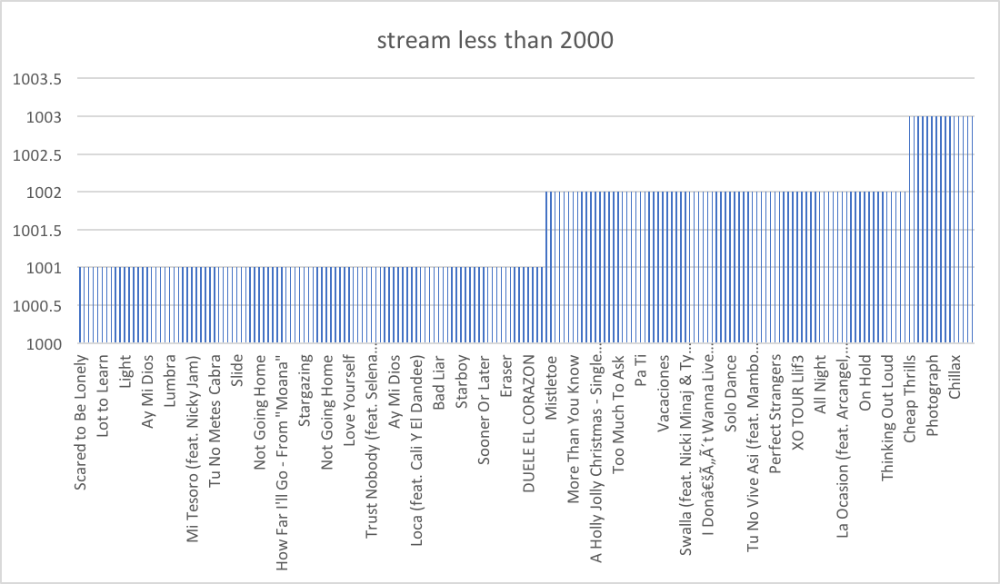
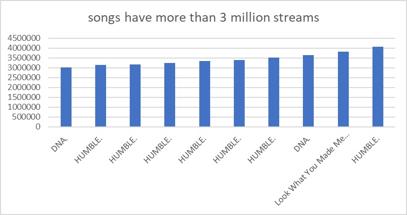
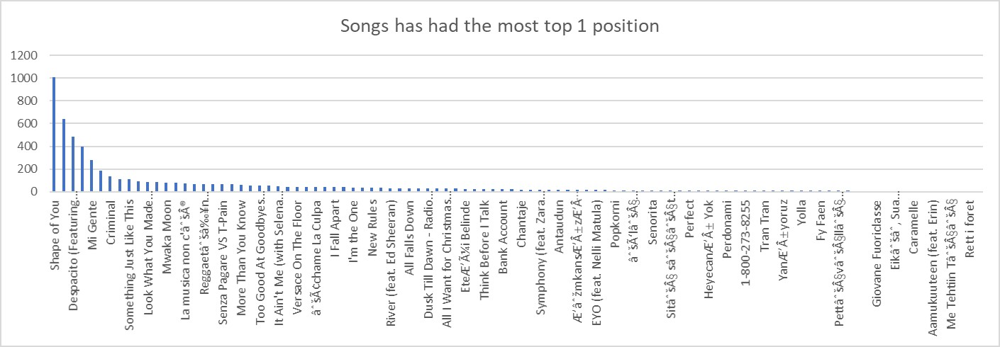
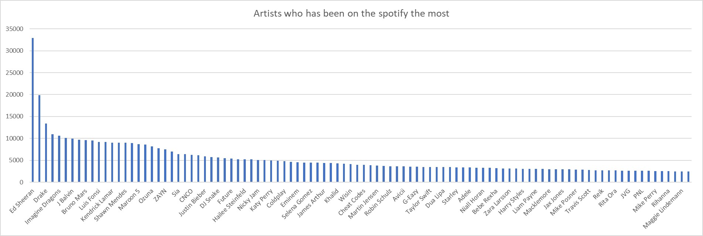
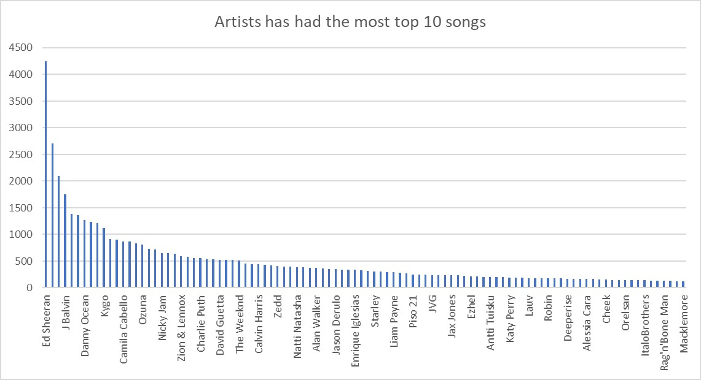

# Checkpoint3 
--Which songs have less than 2000  streams?
```SELECT trackname,
Streams
FROM datasets.spotify_worldwide_daily_song_ranking
WHERE streams< 2000
ORDER BY streams ASC
LIMIT 100
```


--Which songs have more than 3 million streams?
```SELECT trackname,
artist,
Streams
FROM datasets.spotify_worldwide_daily_song_ranking
WHERE streams>3000000
ORDER BY streams ASC
LIMIT 100
```


--Which songs has had the most top 1 position over the years?
```SELECT trackname,
count(*) AS TIME
FROM datasets.spotify_worldwide_daily_song_ranking
WHERE position=1
GROUP BY "trackname"
ORDER BY TIME DESC
LIMIT 100 
```


--Which artists has been on the spotify the most?
```SELECT artist,
count (*) as top_artists
FROM datasets.spotify_worldwide_daily_song_ranking
GROUP BY artist
ORDER BY top_artists DESC
LIMIT 100 
```


--Which artists has had the most top 10 songs over the years?
```SELECT artist,
count(*) AS TIME
FROM datasets.spotify_worldwide_daily_song_ranking
WHERE position<=10 
GROUP BY "artist"
ORDER BY TIME DESC
Limit 100.
```



--What the average streams in top 100? 
```SELECT 
     AVG (streams)
FROM datasets.spotify_worldwide_daily_song_ranking 
WHERE position <= 100 
LIMIT 100
```

-- What is  the highest streams? 
```SELECT max(streams) as max_streams
FROM datasets.spotify_worldwide_daily_song_ranking 
limit 100
```


